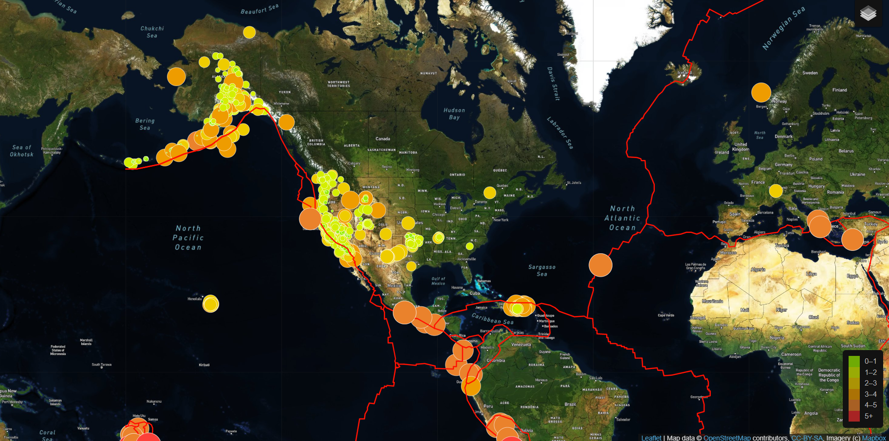

# Mapping earthquakes Project

## Overview
The following project provides visualization of different magnitudes and earthquakes data from all over the world for a period of seven days.
Allowing such visualizations are done using data from an URL for GeoJSON data from earthquakes from OSGS website retrieving geographical coordinates and magnitude of earthquakes. 

Tools used: HTML, CSS, JavaScript (library: Leaflet) 
Leaflet link: [Leaflet](https://leafletjs.com/examples/quick-start/) 

## Layers
### Tectonic Plate Data
One layer consisted of mapping tectonic plates border around the world as seen in the red lines dividing areas around the map.

### Major Earthquake Data
Major earthquakes data ranging of magnitude above 4.5 or more were displayed on its own layer. 
Another layer added also information about smaller earthquakes

### Additional Map
Different maps like satellite view, Navigation night view (dark mode), or street mode are available in the page design able to be turned off or on as desired allowing interactivity. 

Examples are below: 

